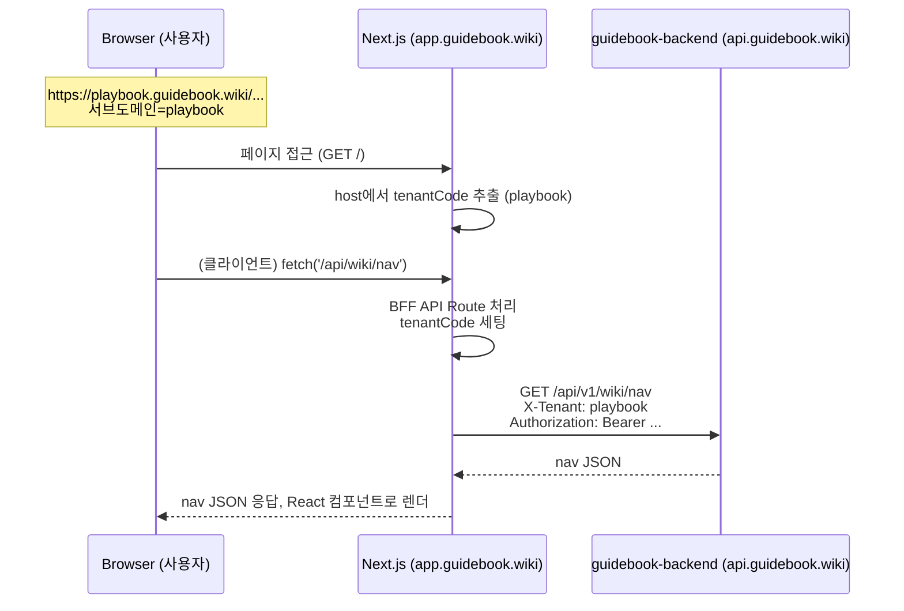

# Guidebook Frontend 설계 v1 (Next.js BFF + 위키 UI)

> **읽기 가이드:** `guidebook-wiki-planning.md` → `guidebook-wiki-layout-and-common-component.md` 순으로 전체 방향과 UI 공통 요소를 본 뒤, 이 문서에서 IA/플로우를 확인하고, 구현 세부는 `guidebook-wiki-frontend-planning-codex.md`에서 이어서 본다.
## 0. 개요

- 레포: `guidebook-frontend`
- 역할:
    - **위키 뷰 UI + 에디터 UI**
    - **BFF(Backend For Frontend)**:
        - 서브도메인 → 테넌트 추출
        - 백엔드 호출 시 `X-Tenant` 헤더 + 인증 헤더 붙이기
    - SEO 대응 (SSR 가능 부분은 SSR 활용)
- 주요 기술 스택:
    - Next.js(App Router)
    - React
    - MDX 렌더링 (Next MDX)
    - MDXEditor (어드민 에디터)
    - TypeScript (권장)

---

# 1. 전체 구조 & 데이터 흐름

## 1-1. 데이터 플로우 (개념)



- **서브도메인 → 테넌트**:
    - `playbook.guidebook.wiki` → `tenantCode = "playbook"`
    - Next 서버 & 클라이언트에서 공통으로 이 값을 쓸 수 있도록 유틸 함수로 분리
- **BFF 역할**:
    - Next API Route(`/api/...`)가 들어오는 요청의 `host`를 보고
        
        자동으로 `X-Tenant`를 붙여 백엔드에 전달
        
    - 클라이언트에서 `Authorization` 헤더로 준 JWT도 그대로 백엔드로 패스

> 포인트:
> 
> 
> **인증/테넌트는 전부 “헤더 기반”**,
> 
> 쿠키에 의존하지 않는 구조.
> 

---

# 2. 라우팅 & 페이지 설계

## 2-1. 라우팅 계층

기본적으로 두 계층으로 본다.

1. **Public / Wiki View 영역**
    - `/` : 테넌트별 홈 (예: API 플레이북 홈)
    - `/docs/[...slug]` : 위키 문서 상세
    - `/search` : 검색 화면
    - `/auth/login`, `/auth/callback` : 로그인 화면 + OAuth 콜백 처리
2. **Admin 영역**
    - `/admin` : 어드민 대시보드 (간단)
    - `/admin/pages` : 문서 리스트/트리
    - `/admin/pages/new` : 새 문서 생성
    - `/admin/pages/[pageId]/edit` : 문서 수정 (MDXEditor)
    - `/admin/plugins` : 플러그인 설정 관리

폴더 예시(App Router):

```
app/
  layout.tsx
  page.tsx                 # / : 테넌트 홈
  docs/
    [...slug]/
      page.tsx             # /docs/aaa/bbb
  search/
    page.tsx               # /search
  auth/
    login/
      page.tsx             # /auth/login (전체 페이지 로그인)
    callback/
      page.tsx             # OAuth 콜백 처리
  admin/
    layout.tsx
    page.tsx               # /admin
    pages/
      page.tsx             # /admin/pages
      new/
        page.tsx           # /admin/pages/new
      [pageId]/
        edit/
          page.tsx         # /admin/pages/{id}/edit
    plugins/
      page.tsx             # /admin/plugins

```

---

## 2-2. 주요 페이지별 역할 & 호출 API

### 2-2-1. `/` (테넌트 홈)

- 역할:
    - 해당 테넌트의 “대문” 역할.
    - API 실전 플레이북 테넌트라면 “카카오 OAuth”, “공공데이터 API” 등 주요 섹션으로 이동 링크 제공.
- 데이터:
    - 최소한 네비게이션 일부 + “이 테넌트 소개 문서” 정도를 보여줘도 좋음.
- 호출 API:
    - `GET /api/v1/wiki/nav`
    - (선택) 테넌트 소개 문서 `GET /api/v1/wiki/pages?path=home` 등

---

### 2-2-2. `/docs/[...slug]` (문서 상세 페이지)

- URL 예:
    - `/docs/kakao/oauth/intro` → `fullPath = kakao/oauth/intro`
- 역할:
    - 왼쪽에 문서 트리(목차), 오른쪽에 문서 내용 MDX 렌더링
    - 문서 내에 플러그인(ActionBlock)이 있을 경우 추가 데이터 패칭
- 필요 데이터:
    1. 문서 트리(nav)
    2. 현재 문서의 메타 + 본문(MDX)
    3. 현재 경로/문서 위치에 따라 상단 breadcrumb (depth 기반)
- API 호출 순서(권장):
    1. 클라이언트/서버에서 `slug` → `fullPath`로 합치기
    2. `GET /api/v1/wiki/nav`
    3. `GET /api/v1/wiki/pages?path={fullPath}`
- 권한:
    - `wiki/pages` 응답에서 `403`/`gateType`을 보고,
        - `AFTER_AD` → 광고/구독 컴포넌트 노출
        - `SUBSCRIBER` → 로그인/구독 유도
    - 일부 상황에서는 먼저 `/wiki/pages/permission`으로 체크 후 UI분기 → 다시 `/wiki/pages` 재요청하는 패턴도 가능 (v1에서는 바로 `/pages`만 써도 됨)

---

### 2-2-3. `/search` (검색 페이지)

- 역할:
    - 검색어를 입력하고 해당 테넌트 내 문서 검색
- 데이터:
    - 검색 결과 리스트(제목, 요약, 링크)
- API:
    - `GET /api/v1/search?q=...`
- UX:
    - 기본은 클라이언트 사이드 검색
    - 나중에 SSR로 “검색 결과 페이지 SEO” 대응하는 것도 가능

---

### 2-2-4. `/auth/login` (전체 페이지 로그인)

- 역할:
    - 모달/팝업 없이 **전체 페이지에서 로그인** 진행.
    - 이메일/비밀번호 폼 + 소셜 로그인 버튼(예: Google, GitHub)을 모두 제공.
- 플로우:
    1. TopBar 로그인 버튼 클릭 → `/auth/login?redirect=현재경로`로 이동.
    2. 폼 로그인 또는 소셜 버튼 클릭 → 외부 OAuth → 백엔드 콜백 → `/auth/callback?token=...&redirect=...`으로 리다이렉트.
    3. 콜백 페이지에서 토큰 저장 후 redirect 처리.
- UI 포인트:
    - 실패 시 폼 에러 메시지 노출.
    - (옵션) 가입/비밀번호 찾기 링크.
    - 상단에는 TopBar + ThemeToggle 유지.

---

### 2-2-5. `/auth/callback` (OAuth 콜백 후 처리)

- 플로우:
    1. 사용자가 OAuth 로그인 → 외부 인증 화면 → 백엔드 콜백 → 다시 `/auth/callback?token=...&tenant=...`로 리다이렉트 된다고 가정.
    2. `/auth/callback` 페이지가 쿼리에서 `token`을 가져와 **프론트 스토리지에 저장**:
        - `localStorage.setItem('guidebook_token', token)` 등
    3. 저장 후, 메인 페이지(또는 redirect param이 있다면 그곳)로 이동.
- 이 페이지는 **거의 로직만 존재하는 “중간 처리 페이지”**.

---

### 2-2-6. `/admin` & `/admin/pages` (어드민 목록/트리)

- 역할:
    - 테넌트 어드민/에디터용 화면.
    - 해당 테넌트의 문서 트리를 편집용 UI로 보여줌.
- 데이터:
    - `GET /api/v1/wiki/nav`
    - (추가로) 페이지별 메타 정보 / 작성자 / 수정일 등 필요 시.
- 권한:
    - `/auth/me` 호출해서 현재 유저의 테넌트 내 역할 확인 → `TENANT_ADMIN` 또는 `EDITOR` 아니면 접근 제한.

---

### 2-2-7. `/admin/pages/new` (문서 생성)

- 역할:
    - MDXEditor를 통해 새 문서를 생성.
- 데이터:
    - 부모 페이지 리스트(선택)
    - 새 문서에 입력할 필드:
        - title, slug, parent, gateType, visibility, iconKey, contentMdx
- API:
    - `POST /api/v1/admin/wiki/pages`
        
        (성공 시 새 문서 상세페이지 or edit 페이지로 이동)
        

---

### 2-2-8. `/admin/pages/[pageId]/edit` (문서 수정)

- 역할:
    - 기존 문서를 불러와 MDXEditor로 수정
- API:
    - `GET /api/v1/wiki/pages?path=...` 또는 pageId 기반 별도 API
    - `PUT /api/v1/admin/wiki/pages/{pageId}`

---

### 2-2-9. `/admin/plugins` (플러그인 설정 리스트/관리)

- 역할:
    - 플러그인 config 리스트
    - 새 플러그인 생성/수정
- API:
    - (리스트) `GET /api/v1/admin/plugins/configs` (추가 예정)
    - (단건 조회) `GET /api/v1/plugins/configs/{configId}`
    - (생성) `POST /api/v1/admin/plugins/configs`
    - (수정) `PUT /api/v1/admin/plugins/configs/{id}`

백엔드 스펙에는 아직 리스트/생성/수정이 상세 정의 안 되어 있으니,

프론트 문서에서 **“이런 API가 필요하다”** 정도로 명시해두고, 백엔드 쪽에서 맞춰주면 됨.

---

# 3. BFF 설계 (Next API Routes)

## 3-1. 기본 개념

- 프론트는 **백엔드 도메인이 달라서 쿠키 공유가 복잡**할 수 있으므로:
    - **항상 Authorization 헤더로 JWT를 들고 다닌다.**
    - BFF(Next API Route)는 들어온 요청의:
        - `host` → `tenantCode` 추출 → `X-Tenant` 헤더 설정
        - `Authorization` 헤더 → 그대로 백엔드로 전달

## 3-2. 예시 구조

```
app/
  api/
    wiki/
      nav/route.ts     # GET /api/wiki/nav → BE /api/v1/wiki/nav
      pages/route.ts   # GET /api/wiki/pages → BE /api/v1/wiki/pages
    search/route.ts    # GET /api/search → BE /api/v1/search
    plugins/
      configs/
        [configId]/route.ts  # GET /api/plugins/configs/{configId}
    auth/
      me/route.ts       # GET /api/auth/me

```

각 Route에서 공통적으로 하는 작업:

1. `req.headers.host`에서 `tenantCode` 추출 (예: `playbook.guidebook.wiki` → `playbook`)
2. `Authorization` 헤더를 읽어온 뒤 백엔드 호출 시 그대로 붙이기
3. 백엔드 응답을 그대로 프론트에 반환

---

## 3-3. 테넌트 추출 유틸

```tsx
function getTenantFromHost(host: string): string {
  // 예: playbook.guidebook.wiki 또는 localhost:3000
  // dev에서는 쿼리나 환경변수로 오버라이드하는 옵션도 두기
}

```

- 이 유틸을 서버/클라이언트 둘 다에서 쓸 수 있게 만들거나,
- 클라이언트에서는 `window.location.host`에서 직접 파싱.

---

# 4. 인증 처리 (프론트 관점)

## 4-1. 토큰 저장 방식

전제: **쿠키를 지양**하고, **헤더 기반**으로 간다.

- 로그인 진입 흐름: `TopBar 로그인 버튼` → `/auth/login?redirect=...` → 외부 OAuth → `/auth/callback?token=...&redirect=...` → 토큰 저장 후 redirect.

- 클라이언트:
    - `/auth/callback`에서 받은 JWT를 `localStorage` 혹은 `sessionStorage`에 저장
        - 예: `localStorage.setItem('guidebook_token', token)`
- 요청 시:
    - 클라이언트에서 BFF API를 호출할 때:
        - `Authorization: Bearer ${token}`을 직접 header에 세팅
- BFF:
    - 전달받은 헤더를 그대로 백엔드로 넘김.

> SSR에서 “로그인된 상태의 페이지를 완벽하게 서버에서 그리는 것”은
> 
> 
> 이 구조에서는 다소 제한적이고,
> 
> v1에서는 **로그인/권한이 필요한 부분은 대부분 클라이언트 측에서 처리**하는 방향으로 두는 게 현실적.
> 

---

## 4-2. 로그인 상태 관리

- 글로벌 상태(예: React Context) 혹은 간단한 hook으로 관리:

```tsx
// 예시 개념
const token = useAuthToken();  // localStorage에서 읽어오기
const { data: me } = useSWR(
  token ? '/api/auth/me' : null,
  fetcherWithAuth(token)
);

```

- `me`를 바탕으로:
    - 헤더에 “로그인/로그아웃 버튼”
    - 어드민 메뉴 접근 여부(`TENANT_ADMIN`, `EDITOR`)

---

# 5. MDX 렌더링 & 에디터

## 5-1. MDX 렌더링 흐름

1. `/api/wiki/pages?path=...` 응답에서 `contentMdx` 받기
2. Next에서 MDX를 React 컴포넌트로 변환
3. 커스텀 컴포넌트 매핑:
    - `<ActionBlock ... />` → React 컴포넌트 등록
    - 기타 코드블럭, 테이블, 경고박스 등도 컴포넌트화 가능

개념 코드:

```tsx
import { useMemo } from 'react';
import { compileMdxToComponent } from '@/lib/mdx'; // 유틸 래핑

export function WikiContent({ contentMdx }: { contentMdx: string }) {
  const Component = useMemo(
    () => compileMdxToComponent(contentMdx, {
      ActionBlock: ActionBlockComponent,
      // 기타 커스텀 컴포넌트
    }),
    [contentMdx]
  );

  return <Component />;
}

```

---

## 5-2. MDXEditor (어드민용)

- `/admin/pages/new`, `/admin/pages/[id]/edit` 화면:
    - 우측에 MDXEditor
    - 좌측에 기본 메타 필드(Form): title, slug, gateType, visibility 등
- 저장 버튼 클릭 시:
    - 현재 MDXEditor의 내용을 `contentMdx` 문자열로 얻어서
    - `POST /api/v1/admin/wiki/pages` 또는 `PUT /api/v1/admin/wiki/pages/{id}` 호출

편집 UX 목표:

- 기본적으로 VSCode 마크다운 + 미리보기 느낌
- ActionBlock 같은 컴포넌트는:
    - 단순 문자열로 삽입해도 되고,
    - 나중에는 UI로 삽입하는 기능(“API 콘솔 블록 추가” 버튼 등)을 제공할 수도 있음 (후순위)

---

# 6. 플러그인 블록 렌더링

## 6-1. 프론트 컴포넌트 개념

MDX에서 `<ActionBlock type="api-console" configId="kakao-oauth-main" />` 라고 써 있으면

프론트에서는 `ActionBlock` 컴포넌트를 다음처럼 구현:

```tsx
type ActionBlockProps = {
  type: string;
  configId: string;
};

export function ActionBlock({ type, configId }: ActionBlockProps) {
  const token = useAuthToken(); // 필요하면
  const { data, error, isLoading } = useSWR(
    `/api/plugins/configs/${configId}`,
    fetcherWithAuth(token)
  );

  if (isLoading) return <div>불러오는 중...</div>;
  if (error) return <div>플러그인 로딩 오류</div>;

  switch (data.type) {
    case 'API_CONSOLE':
      return <ApiConsole config={data.settings} />;
    case 'DIAGRAM':
      return <DiagramViewer config={data.settings} />;
    default:
      return <div>알 수 없는 플러그인 타입</div>;
  }
}

```

- 이렇게 하면, **플러그인 타입별 UI 로직은 프론트가 담당**,
    
    설정/보안/권한은 백엔드가 관리.
    

---

# 7. 검색 / 권한 / 에러 처리

## 7-1. 검색

- `/search` 페이지:
    - 인풋 + 검색 결과 리스트
    - onSubmit → `GET /api/search?q=...`
- 나중에 ES 붙이면, 동일 API를 ES 기반으로 구현

## 7-2. 권한

- 페이지 접근 시:
    - 문서 조회 API에서 `403`이 오면, `error.details.gateType`에 따라:
        - 광고 보기/구독 유도 모달 노출
        - 로그인 페이지로 보내기 등
- 필요하다면:
    - 별도 `GET /api/v1/wiki/pages/permission?path=...`를 먼저 호출해서
        
        **권한 UI만 먼저 그리고**, “열람 허용”이 된 뒤에 `/pages` 다시 호출하는 패턴도 사용할 수 있음.
        

---

# 8. FCM 연동 (프론트 관점)

- 브라우저:
    1. 서비스 워커 등록
    2. FCM에서 토큰 발급
    3. 로그인된 상태라면 `POST /api/notifications/fcm-token` 호출
- 백엔드에서 알림 발송 시:
    - 테넌트/유저 기준으로 토큰 조회 → FCM push

프론트 문서에는:

- “FCM 토큰 발급 + 서버 전송 플로우”
- 나중에 구현할 때 참고할만한 위치 (`App` 루트, 레이아웃 초기 구동 시점 등)를 메모 정도로 남겨두면 충분.

---

# 9. SEO 전략 (간단 버전)

- 가능한 페이지:
    - 테넌트 홈 (`/`)
    - 문서 상세 (`/docs/[...slug]`)
- 전략:
    - 초기에 문서 렌더링은 **CSR(클라이언트 패칭)**으로 시작해도 되지만,
    - API 실전 플레이북 핵심 문서들에 대해서는 점차:
        - Next의 서버 컴포넌트에서 `fetch`를 이용해 SSR/SSG 도입
- 제약:
    - 인증이 필요한 문서나 개인화된 내용은 SSR에서 제한적으로,
        
        대부분은 “공개 문서 = SSR”, “권한 필요 문서 = CSR 로딩 + 권한 체크” 형태로 구성하는 게 현실적.
        

---

# 10. v1 프론트 구현 우선순위

1. **기본 골조**
    - App Router 셋업
    - 테넌트 추출 유틸
    - BFF API 라우트 기본 패턴
2. **Wiki View**
    - `/` 홈
    - `/docs/[...slug]` 문서 뷰
    - nav + page 조회 → UI 렌더
    - MDX 렌더링
3. **Auth 최소 플로우**
    - `/auth/callback`에서 token 저장
    - `/api/auth/me` 호출 & 상단 로그인 상태 표시
4. **Admin 최소 기능**
    - `/admin/pages` 리스트
    - `/admin/pages/new`, `/admin/pages/[id]/edit` + MDXEditor
5. **플러그인 블록 v1**
    - `/api/plugins/configs/{configId}` 호출
    - `ActionBlock` 컴포넌트 + `API_CONSOLE` 타입 1개만 먼저 구현
6. **검색 페이지 `/search`**

이 정도가 **“프론트를 AI에게 맡겼을 때, 오해 없이 구현 가능한 스펙 v1”**이라고 보면 될 것 같아.

---